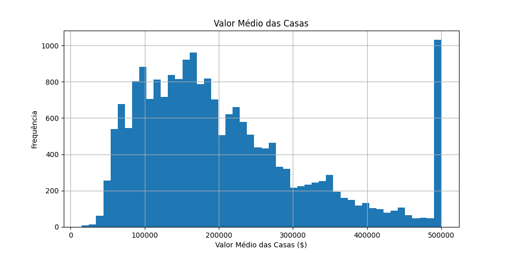
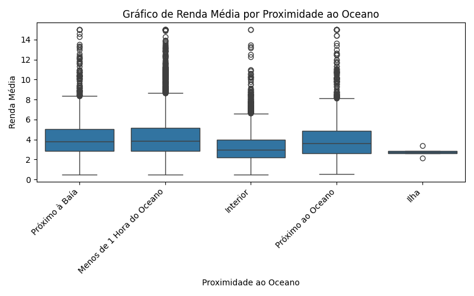
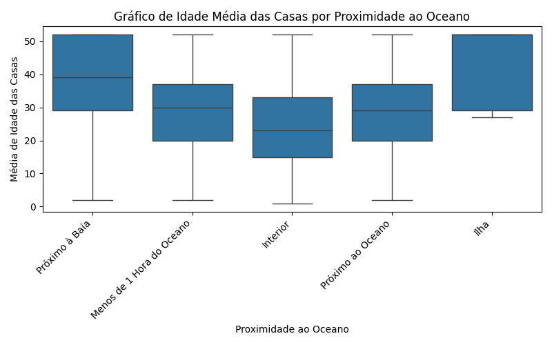

# Relatório do Projeto: California Housing Prices

## Tema do Projeto
Prever os preços das casas na Califórnia com base em diversos recursos.

## URL no GitHub
[California Housing Prices](https://github.com/ageron/handson-ml2)

## Dataset Utilizado
- Origem: [California Housing dataset](https://raw.githubusercontent.com/ageron/handson-ml2/master/datasets/housing/housing.csv)
- Variáveis: longitude, latitude, housing_median_age, total_rooms, total_bedrooms, population, households, median_income, median_house_value, ocean_proximity

## Modificações no Dataset Original
- Nenhuma modificação foi realizada no dataset de exemplo.

## Análise Exploratória de Dados
- Visualização do Valor Médio das Casas:

- Variáveis Importantes por Proximidade ao Oceano:

  - Renda Média:

  

  - Idade Média das Casas:

  

  - Valor Médio das Casas:

  

## Resultados Obtidos

Nesta seção, apresentamos uma análise detalhada das estatísticas descritivas do conjunto de dados "California Housing Prices". Essas estatísticas fornecem insights valiosos sobre as características e distribuições das variáveis relevantes, fornecendo uma base sólida para a compreensão do cenário imobiliário na Califórnia. Abaixo estão alguns pontos-chave destacados pelas estatísticas descritivas:

### 1. Longitude e Latitude
- **Longitude Média:** As coordenadas geográficas médias indicam uma localização centralizada, aproximadamente a -119.57.
- **Latitude Média:** A latitude média, em torno de 35.63, sugere que os dados se concentram em uma região específica da Califórnia.

### 2. Idade Média das Casas
- **Média de Idade das Casas:** A idade média das casas na região é de 28.64 anos. Isso pode influenciar significativamente as preferências dos compradores e as condições gerais do mercado imobiliário.

### 3. Renda Média
- **Renda Média:** A renda média da população local é de 3.87, indicando o potencial de compra dos residentes.

### 4. Valores Médios das Casas
- **Valor Médio das Casas:** O valor médio das casas é de $206,855.82. Esta informação é crucial para avaliar a acessibilidade e a faixa de preços do mercado imobiliário.

### 5. Distribuição de População e Habitações
- **População Média:** A população média é de 1425.48, enquanto o número médio de domicílios é de 499.54. Esses números refletem o tamanho médio das comunidades locais.

### 6. Estatísticas Adicionais
- **Variabilidade:** A presença de desvios padrão e valores mínimos e máximos fornece insights sobre a variabilidade e a amplitude das variáveis em questão.

Essas análises estatísticas formam a base para as etapas subsequentes do projeto, permitindo uma compreensão mais profunda das nuances do mercado imobiliário da Califórnia. Além disso, servirão como referência ao explorar relações mais complexas e ao desenvolver modelos preditivos no decorrer do projeto.

- Algumas estatísticas descritivas:

|       |   longitude |    latitude |   housing_median_age |   total_rooms |   total_bedrooms |   population |   households |   median_income |   median_house_value |
|:------|------------:|------------:|---------------------:|--------------:|-----------------:|-------------:|-------------:|----------------:|---------------------:|
| count | 20640       | 20640       |           20640      |      20640    |        20433     |     20640    |     20640    |     20640       |                20640 |
| mean  |  -119.57    |    35.6319  |              28.6395 |       2635.76 |          537.871 |      1425.48 |       499.54 |         3.87067 |               206856 |
| std   |     2.00353 |     2.13595 |              12.5856 |       2181.62 |          421.385 |      1132.46 |       382.33 |         1.89982 |               115396 |
| min   |  -124.35    |    32.54    |               1      |          2    |            1     |         3    |         1    |         0.4999  |                14999 |
| 25%   |  -121.8     |    33.93    |              18      |       1447.75 |          296     |       787    |       280    |         2.5634  |               119600 |
| 50%   |  -118.49    |    34.26    |              29      |       2127    |          435     |      1166    |       409    |         3.5348  |               179700 |
| 75%   |  -118.01    |    37.71    |              37      |       3148    |          647     |      1725    |       605    |         4.74325 |               264725 |
| max   |  -114.31    |    41.95    |              52      |      39320    |         6445     |     35682    |      6082    |        15.0001  |               500001 |
