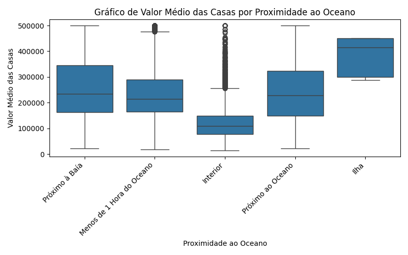

# Relatório do Projeto: California Housing Prices

## Tema do Projeto
Prever os preços das casas na Califórnia com base em diversos recursos.

## URL no GitHub
[California Housing Prices](https://github.com/ageron/handson-ml2)

## Dataset Utilizado
- Origem: [California Housing dataset](https://raw.githubusercontent.com/ageron/handson-ml2/master/datasets/housing/housing.csv)
- Variáveis: longitude, latitude, housing_median_age, total_rooms, total_bedrooms, population, households, median_income, median_house_value, ocean_proximity

## Modificações no Dataset Original
- Nenhuma modificação foi realizada no dataset de exemplo.

## Análise Exploratória de Dados
- Visualização do Valor Médio das Casas:

- Boxplots de Variáveis Importantes por Proximidade ao Oceano:
  - Renda Média:
  

  - Idade Média das Casas:
  

  - Valor Médio das Casas:
  

## Modelos Utilizados ou Desenvolvidos
- Neste script de exemplo, a ênfase foi na análise exploratória de dados, e nenhum modelo de aprendizado de máquina específico foi desenvolvido. 
  Futuramente, ao evoluir o projeto, modelos podem ser explorados e incluídos nesta seção.

## Resultados Obtidos
- Algumas estatísticas descritivas:
|       |   longitude |    latitude |   housing_median_age |   total_rooms |   total_bedrooms |   population |   households |   median_income |   median_house_value |
|:------|------------:|------------:|---------------------:|--------------:|-----------------:|-------------:|-------------:|----------------:|---------------------:|
| count | 20640       | 20640       |           20640      |      20640    |        20433     |     20640    |     20640    |     20640       |                20640 |
| mean  |  -119.57    |    35.6319  |              28.6395 |       2635.76 |          537.871 |      1425.48 |       499.54 |         3.87067 |               206856 |
| std   |     2.00353 |     2.13595 |              12.5856 |       2181.62 |          421.385 |      1132.46 |       382.33 |         1.89982 |               115396 |
| min   |  -124.35    |    32.54    |               1      |          2    |            1     |         3    |         1    |         0.4999  |                14999 |
| 25%   |  -121.8     |    33.93    |              18      |       1447.75 |          296     |       787    |       280    |         2.5634  |               119600 |
| 50%   |  -118.49    |    34.26    |              29      |       2127    |          435     |      1166    |       409    |         3.5348  |               179700 |
| 75%   |  -118.01    |    37.71    |              37      |       3148    |          647     |      1725    |       605    |         4.74325 |               264725 |
| max   |  -114.31    |    41.95    |              52      |      39320    |         6445     |     35682    |      6082    |        15.0001  |               500001 |

- Data do Relatório: 2023-11-26 13:20:18
